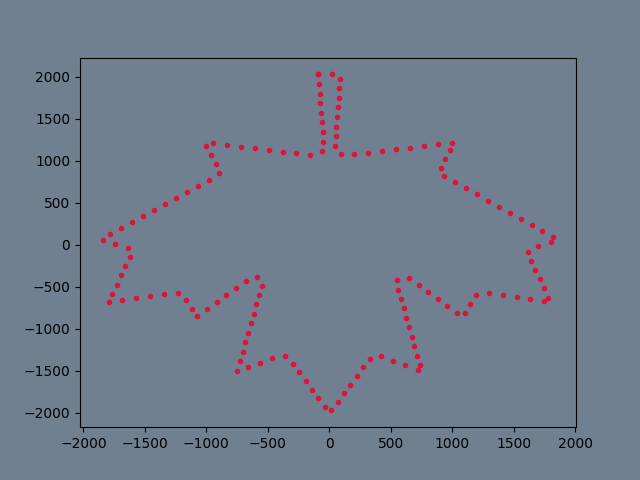
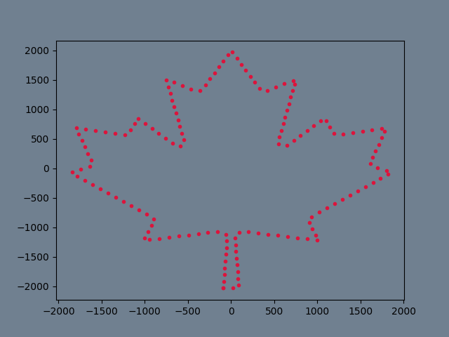
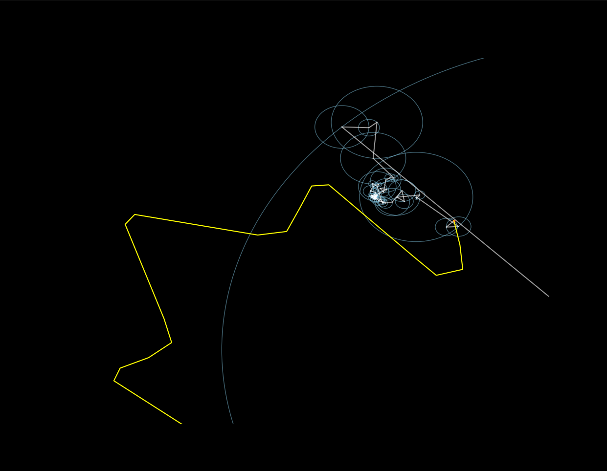

# drawing_with_fourier_series

Using Complex Fourier Series, we can draw outlined images. Here I am accomplishing it with python. 

First, we need discrete points on the outline path we want to draw. I am using svg file to get that. To read the svg file and grab the path string use: `read_svg()`.
One thing to notice is, those discrete points will create an image mirrored with respect to (w.r.t) the x-axis.

`create_discrete_points()` will automatically fix this. 

Now performing the DFT on those points will give us the Complex Frequencies present in
those points. This can be done with `dft()` function.

Then using those complex frequencies we can recreate the given signal. 
`draw_with_coefficients()` does exactly that.

